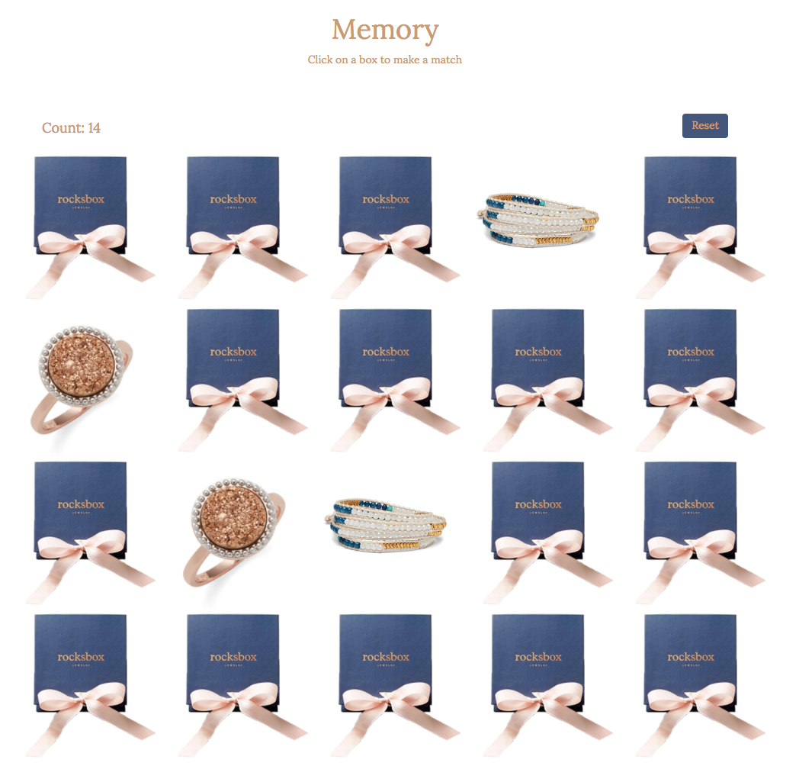

## Memory

A simple matching and memory game that tracks user clicks and provides the ability to reset a game.

### Installation

To get this app up and running locally:

1.  `git clone git@github.com:erintherad/match-game.git`
2. `cd` into application
3. `npm i` to install `http-server` dependency
4. In your terminal run `http-server`
5. Go to [browser](http://localhost:8080/) or localhost:8080

### Tech

This application was built with:

* jQuery for functionality
* Lodash for flexability
* Twitter Bootstrap for layout
